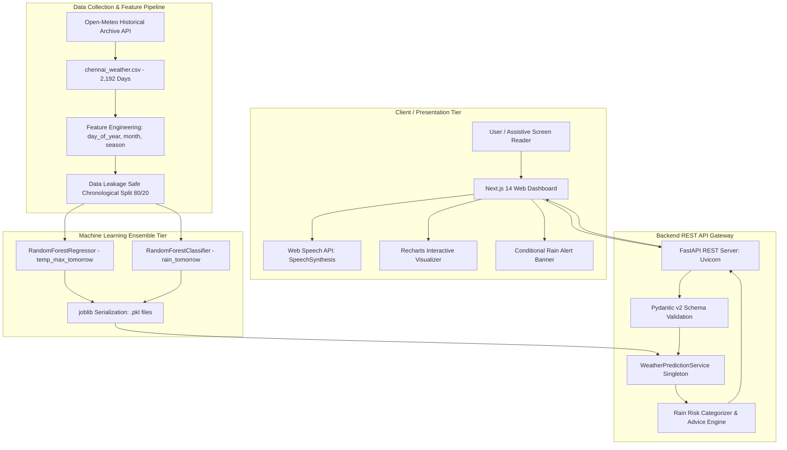
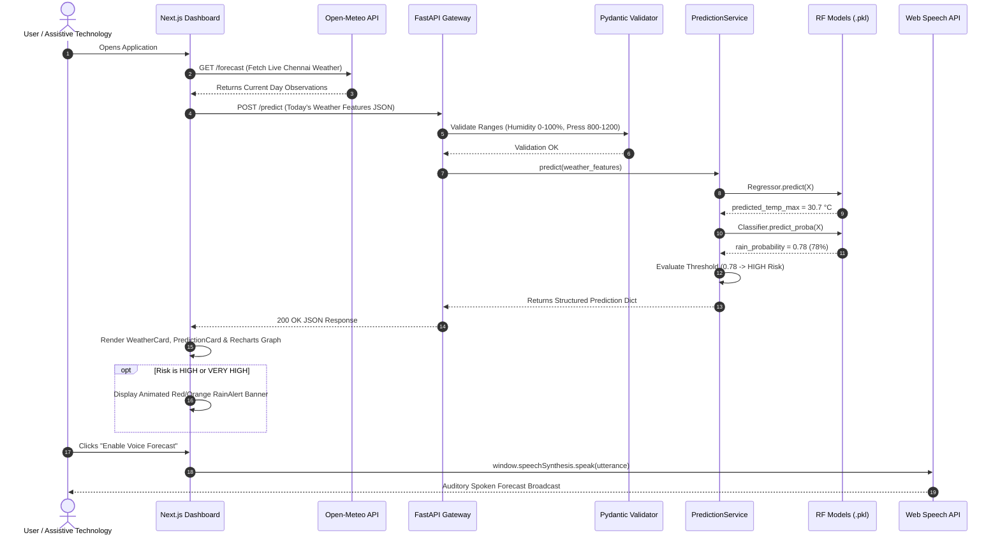

# Project Architecture & Workflow Diagrams
## Accessible AI Weather Forecasting and Rain Alert System

This document contains all system architecture diagrams, data pipelines, sequence flows, and risk decision structures formatted in **ASCII text**, **Unicode boxes**, and **Mermaid.js** diagrams ready to be copied into Overleaf, LaTeX, MS Word, or PowerPoint presentations.

---

## 1. High-Level System Architecture (End-to-End)

### Mermaid Diagram


---

## 2. Temporal Data Leakage Elimination & Pipeline Flow

```text
+-----------------------------------------------------------------------------------+
|                        CHRONOLOGICAL TIME-SERIES PIPELINE                         |
+-----------------------------------------------------------------------------------+
|  Date (t)   | Features X(t) [Temp, Rain, Press...] | Targets y(t) [Shifted to t+1]|
|-------------|--------------------------------------|------------------------------|
| 2020-01-01  | Max: 26.9°C, Rain: 6.6mm, Press...   | Temp_Next: 27.3°C, Rain_Next:1|
| 2020-01-02  | Max: 27.3°C, Rain: 2.3mm, Press...   | Temp_Next: 28.7°C, Rain_Next:1|
| 2020-01-03  | Max: 28.7°C, Rain: 1.6mm, Press...   | Temp_Next: 28.8°C, Rain_Next:1|
|     ...     |                 ...                  |             ...              |
| 2025-12-30  | Max: 29.2°C, Rain: 0.0mm, Press...   | Temp_Next: 29.5°C, Rain_Next:0|
| 2025-12-31  | [DROPPED: No known ground truth for next day]                        |
+-----------------------------------------------------------------------------------+
                                         │
                   Chronological 80/20 Split (NO SHUFFLE)
                                         │
        ┌────────────────────────────────┴────────────────────────────────┐
        ▼                                                                 ▼
Training Partition (80%)                                          Testing Partition (20%)
1,752 Daily Records                                              439 Daily Records
Jan 01, 2020 -> Oct 17, 2024                                     Oct 18, 2024 -> Dec 30, 2025
        │                                                                 │
        ▼                                                                 ▼
Model Training (Random Forest)                                   Unbiased Generalization Test
                                                                 MAE = 0.940°C, F1 = 0.849
```

---

## 3. Sequence Diagram of API Request & Inference Flow

### Mermaid Sequence Diagram


---

## 4. Rain Risk Level Decision Logic

```text
                          ML-Estimated Rain Probability: P(Rain)
                                           │
                    ┌──────────────────────┼──────────────────────┐
                    ▼                      ▼                      ▼
             0.00 <= P <= 0.30      0.31 <= P <= 0.60      0.61 <= P <= 0.80
                    │                      │                      │
             Risk: LOW              Risk: MODERATE         Risk: HIGH
             Advice: Outdoor        Advice: Keep an        Advice: Carry
             activities fine.       umbrella nearby.       an umbrella.
                    │                      │                      │
                    └──────────────────────┼──────────────────────┘
                                           │
                                           ▼
                                    0.81 <= P <= 1.00
                                           │
                                    Risk: VERY HIGH
                                    Advice: Avoid unnecessary
                                    outdoor travel.
```

---

## 5. Screen Reader & Accessibility Flow

```text
                           Keyboard Focus (Tab Key)
                                      │
                                      ▼
                        Voice Accessibility Button
                                      │
                 Does browser support window.speechSynthesis?
                                ├── No ──> Render Fallback Status
                                └── Yes ─> Create SpeechSynthesisUtterance
                                                  │
                                                  ▼
                                     Set Pitch: 1.0, Rate: 0.95
                                                  │
                                                  ▼
                                      Spoken Text Assembly:
"Tomorrow in Chennai, the predicted maximum temperature is [X] degrees Celsius.
 The estimated probability of rain is [Y] percent. Rain risk is [Z]. [Advice]"
                                                  │
                                                  ▼
                                       Audio Playback (Speakers)
```
